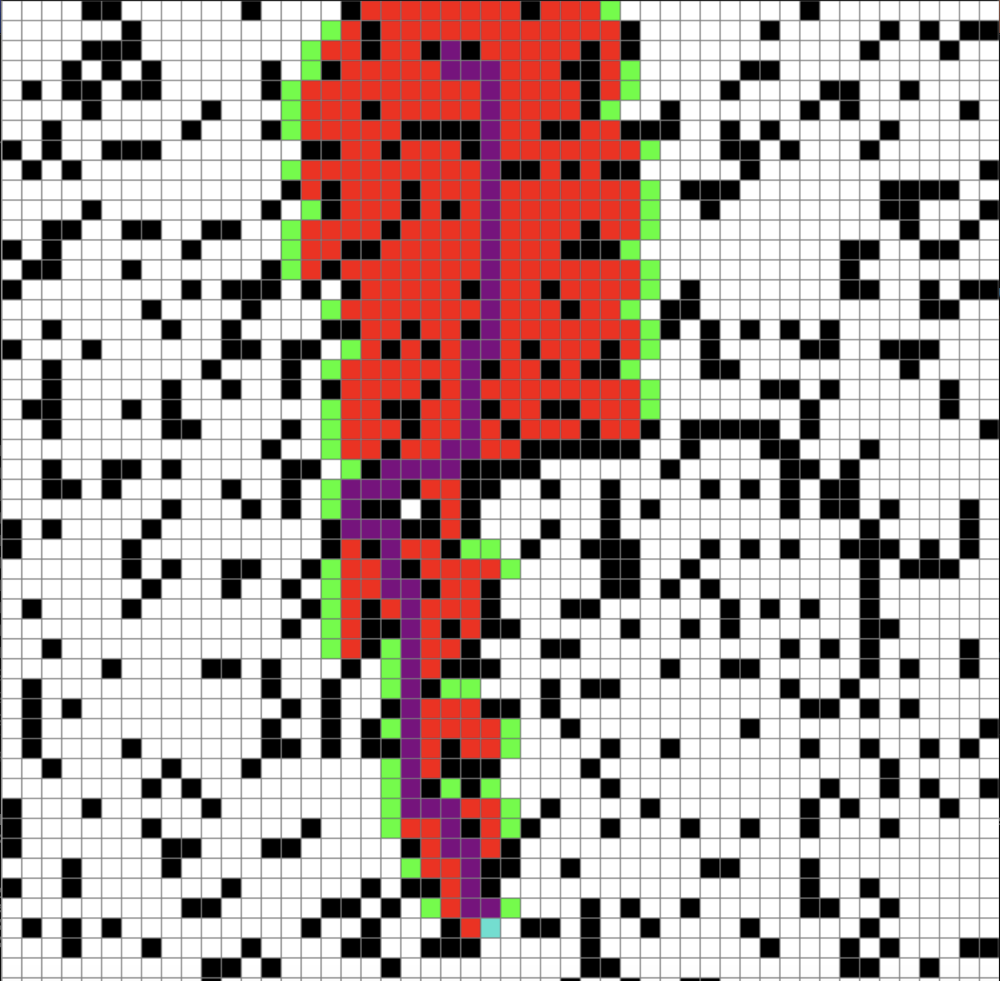

# A* Pathfinding Algorithm Visualizer

A Python-based interactive visualization tool for the A* pathfinding algorithm. Watch the algorithm find the shortest path between two nodes while avoiding randomly generated barriers. Built with Pygame.



## Features

- **Interactive Grid**: 
  - Left-click to place start/end nodes and barriers
  - Right-click to remove nodes
  - Spacebar to start pathfinding
  - 'C' key to clear the grid
- **Visual Feedback**:
  - Open nodes (green)
  - Closed nodes (red)
  - Path nodes (purple)
  - Barriers (black)
- **Algorithm Details**:
  - Uses Manhattan distance as primary heuristic
  - Includes Euclidean distance alternative
  - Priority queue implementation
- **Random Generation**:
  - 20% of nodes randomly initialized as barriers
  - 50x50 grid layout

## Installation

1. **Prerequisites**:
   - Python 3.x
   - Pygame library

2. **Run**:
   ```bash
   pip install pygame
   cd A_Star
   python3 astar.py