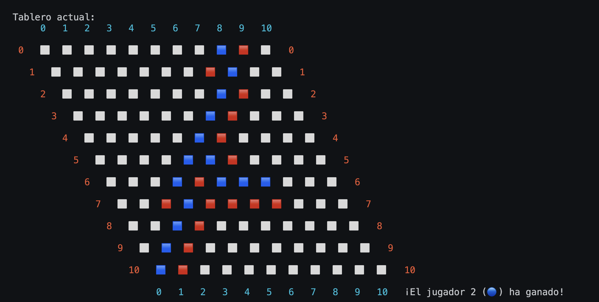

# Hex Game Agent using MCTS + RAVE

This project implements an intelligent agent that plays the board game **Hex** using **Monte Carlo Tree Search (MCTS)** with **Rapid Action Value Estimation (RAVE)** enhancements. The algorithm is designed to make smart, strategic decisions through simulations and statistical learning.

---

## 📌 Overview

This AI agent is capable of playing the Hex game autonomously by evaluating moves using a **Monte Carlo Tree Search (MCTS)** approach. To improve convergence speed and move evaluations during simulations, it leverages the **RAVE** strategy — allowing it to generalize from moves seen during random playouts.

---

## 🎯 Key Features

- **MCTS-based decision making**: The AI explores possible game states by simulating thousands of potential games to find the most promising move.
- **RAVE-enhanced selection**: Accelerates learning by reusing simulation information across similar moves.
- **Early-win detection**: The agent checks for immediate winning moves before committing to MCTS.
- **Playout tracking**: Tracks every move in a simulation for accurate RAVE updates.

---

## 🧠 How the Algorithm Works

### 1. **Play Method Entry Point**
The `RavePlayer` class overrides the `play()` method. Before invoking MCTS, it first checks for any move that can immediately win the game. If none exist, it begins MCTS to find the best move.

### 2. **MCTS Phases**

#### ▸ Selection
Starting from the root node (current board state), the algorithm recursively selects child nodes using a combination of exploitation, exploration, and RAVE value — choosing the child with the best score:

$score = (1 - \beta) \cdot \text{exploitation} + \beta \cdot \text{raveValue} + \text{exploration}$

Where:
- `exploitation = wins / visits`
- `exploration = sqrt(log(parent.visits) / visits)`
- `β` is computed as: `sqrt(rave_const / (rave_const + 3 * visits))`

#### ▸ Expansion
If the current node is not fully expanded, one of the untried moves is randomly chosen and added as a new child node.

#### ▸ Simulation (Playout)
A random game is simulated from the current node until a win is detected. The full list of moves and who played them is recorded.

#### ▸ Backpropagation
The result of the simulation is propagated up the tree:
- Win/loss stats are updated.
- RAVE statistics (visits and wins) are updated for **all moves** played by the player from that node.

### 3. **Best Move Selection**
After completing the iterations (or reaching the time limit), the child with the **highest number of visits** is chosen as the next move.

---

## 🧪 Parameters

- `mcts_iterations`: Number of simulations to perform. Default is `6000`.
- `rave_const`: Controls the influence of RAVE statistics. Higher values give more weight to RAVE early on.

---
## How it looks a game of Hex

